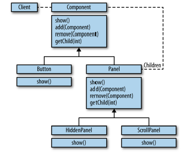
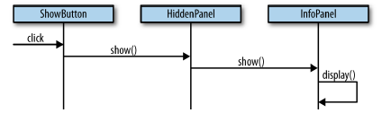
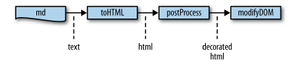
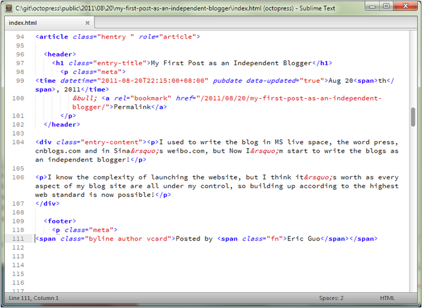
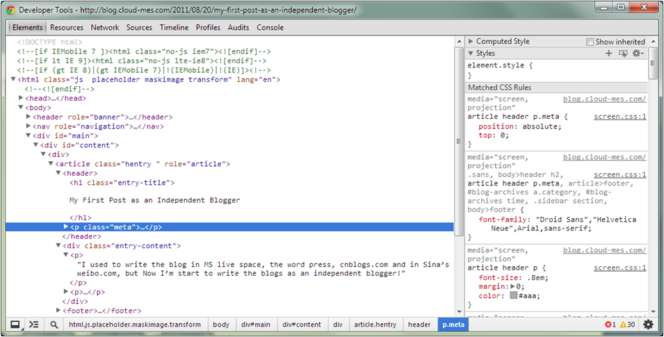
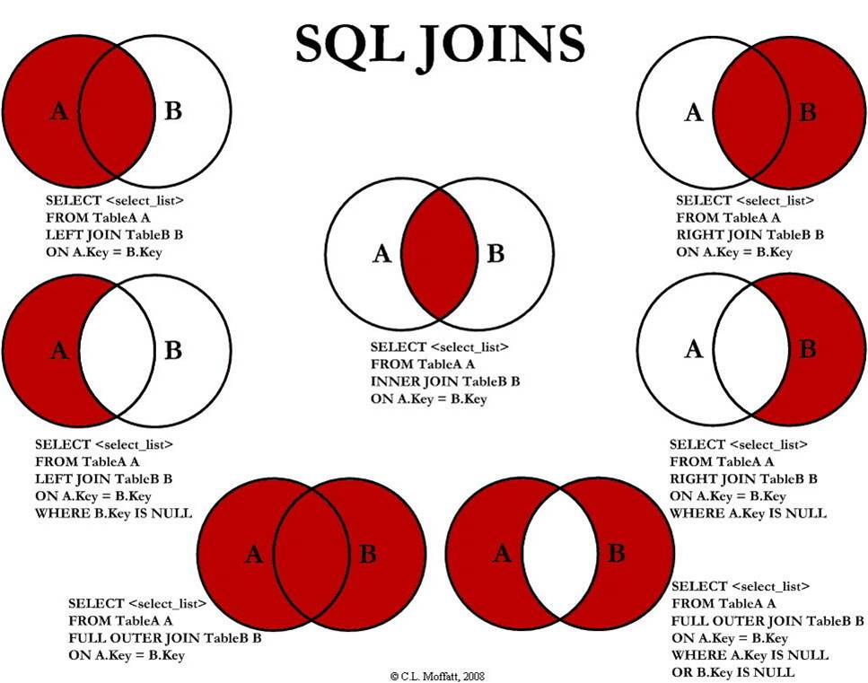

SQL & R
========================================================
## your first & second declarative functional programming language

>Presentation URL: [http://metrotest.sandisk.com/sql/](http://metrotest.sandisk.com/sql/)

>Hint: press ESC key to navigate

```yaml
author: Eric Guo
  date: 2013-10-15
 weibo: @ecguo
```


Agenda
========================================================
- Why SQL / R design like currently status
    - Terminology
    - Programming paradigms
- Learning SQL
    - SQL step by step with R
***
(rest)

- Practice SQL
- Sandisk reporting


# <center>**Functional**</center>
# <center>vs</center>
# <center>Object-oriented</center>


Object-oriented
========================================================

***



Functional (markdown)
========================================================




Functional (html)
========================================================



Functional (decorated DOM)
========================================================



Functional (web page)
========================================================


# <center>**Declarative**</center>
# <center>vs</center>
# <center>Imperative</center>


Declarative vs Imperative
========================================================


Imperative programming style (R)
========================================================
Imperative languages are often restricted to a level of detail that is good for their compilers rather than for their programmers (Sokolowski 1991).

```r
numbers <- c(1,2,3,4,5)
doubles <- c()

for(x in numbers) {
  doubles <- append(doubles, x*2)
}
doubles
```
```
[1]  2  4  6  8 10
```


Declarative programming style (R)
========================================================
declarative programming is a programming paradigm, a style of building the structure and elements of computer programs, that expresses the logic of a computation without describing its control flow.

```r
numbers<-c(1,2,3,4,5)
doubles=sapply(numbers, function(x) x*2)
doubles
```
```
[1]  2  4  6  8 10
```


Declarative programming style (Ruby)
========================================================
More favorite programming syntax in declarative style is functional

```ruby
ruby 2.0.0p247 [i386-mingw32]

c:\git>irb
irb(main):001:0> (1..5).map {|x| x*2}
```
```
=> [2, 4, 6, 8, 10]
```


Functional programming (Scala)
========================================================
Functional programming has type and also have speed.

```scala
Welcome to Scala version 2.10.2 (Java HotSpot(TM) Client VM, Java 1.7.0_40).
scala> 1 to 5
res0: collection.immutable.Range = Range(1, 2, 3, 4, 5)

scala> { x:Int => x * 2 }
res1: Int => Int = <function1>
```

And it's keystone for parallel in muti-core era.

```scala
scala> 1 to 5 map { _ * 2 }
res2: collection.immutable.IndexedSeq[Int] = Vector(2, 4, 6, 8, 10)

scala> (1 to 5).par map { x => x * 2 }
res3: collection.parallel.immutable.ParSeq[Int] = ParVector(2, 4, 6, 8, 10)
```


Getting SQL data in R (adv)
========================================================

```r
library(ROracle)
con <- dbConnect(dbDriver("Oracle"), username="sql_training", password="sq1trn", dbname="SPMSTST")
sql_statement <- dbSendQuery(con, "
SELECT *
FROM dogs t
")
fetch(sql_statement, n=-1)
```
```
     NAME OWNER_ID
1    Fido        1
2     Bob        1
3 A Huang        2
4    Wolf       NA
```


Define function to query data in SQL (adv)
========================================================

```r
sql = function(sql_text) {
  fetch(dbSendQuery(con,sql_text), n= -1)
}
sql("select * from owners t")
```
```
  ID OWNER
1  1  Eric
2  2 Alick
3  3 Cindy
```


Functional paradigms in SQL & R
========================================================

```r
sql("SELECT *
     FROM dogs
     INNER JOIN owners on owner_id=id")
```
```
     NAME OWNER_ID ID OWNER
1     Bob        1  1  Eric
2    Fido        1  1  Eric
3 A Huang        2  2 Alick
```

```r
dogs <- dbReadTable(con, "DOGS")
owners <- dbReadTable(con, "OWNERS")
merge(x=dogs, y=owners, by.x="OWNER_ID", by.y="ID")
```

```
  OWNER_ID    NAME OWNER
1        1    Fido  Eric
2        1     Bob  Eric
3        2 A Huang Alick
```


Compare with Imperative Programming
========================================================
```javascript
var dogsWithOwners = []
var dog, owner

for(var di=0; di < dogs.length; di++) {
  dog = dogs[di]

  for(var oi=0; oi < owners.length; oi++) {
    owner = owners[oi]

    if (owner && dog.owner_id == owner.id) {
      dogsWithOwners.push({
        dog: dog,
        owner: owner
      })
    }
  }}
}
```


INNER JOINS in SQL & R
========================================================
```r
sql("SELECT * FROM dogs
     INNER JOIN owners on owner_id=id")
```
```
     NAME OWNER_ID ID OWNER
1     Bob        1  1  Eric
2    Fido        1  1  Eric
3 A Huang        2  2 Alick
```

```r
merge(x=dogs, y=owners, by.x="OWNER_ID", by.y="ID")
```
```
  OWNER_ID    NAME OWNER
1        1    Fido  Eric
2        1     Bob  Eric
3        2 A Huang Alick
```


The SQL JOINS
========================================================



OUTER JOINS in SQL & R
========================================================

```r
sql("SELECT * FROM dogs
     FULL OUTER JOIN owners on owner_id=id")
```

```
     NAME OWNER_ID ID OWNER
1    Fido        1  1  Eric
2     Bob        1  1  Eric
3 A Huang        2  2 Alick
4    Wolf       NA NA  <NA>
5    <NA>       NA  3 Cindy
```

```r
merge(x=dogs, y=owners, by.x="OWNER_ID", by.y="ID", all = TRUE)
```

```
  OWNER_ID    NAME OWNER
1        1    Fido  Eric
2        1     Bob  Eric
3        2 A Huang Alick
4        3    <NA> Cindy
5       NA    Wolf  <NA>
```


LEFT OUTER JOINS in SQL & R
========================================================

```r
sql("SELECT * FROM dogs
     LEFT OUTER JOIN owners on owner_id=id")
```

```
     NAME OWNER_ID ID OWNER
1     Bob        1  1  Eric
2    Fido        1  1  Eric
3 A Huang        2  2 Alick
4    Wolf       NA NA  <NA>
```

```r
merge(x=dogs, y=owners, by.x="OWNER_ID", by.y="ID", all.x = TRUE)
```

```
  OWNER_ID    NAME OWNER
1        1    Fido  Eric
2        1     Bob  Eric
3        2 A Huang Alick
4       NA    Wolf  <NA>
```


RIGHT OUTER JOINS in SQL & R
========================================================

```r
sql("SELECT * FROM dogs
     RIGHT OUTER JOIN owners on owner_id=id")
```

```
     NAME OWNER_ID ID OWNER
1    Fido        1  1  Eric
2     Bob        1  1  Eric
3 A Huang        2  2 Alick
4    <NA>       NA  3 Cindy
```

```r
merge(x=dogs, y=owners, by.x="OWNER_ID", by.y="ID", all.y = TRUE)
```

```
  OWNER_ID    NAME OWNER
1        1    Fido  Eric
2        1     Bob  Eric
3        2 A Huang Alick
4        3    <NA> Cindy
```


LEFT JOINS - INNER JOIN in SQL & R
========================================================

```r
sql("SELECT * FROM dogs
     LEFT OUTER JOIN owners on owner_id=id
     WHERE owner_id is null")
```

```
  NAME OWNER_ID ID OWNER
1 Wolf       NA NA  <NA>
```

```r
lj <- merge(x=dogs, y=owners, by.x="OWNER_ID", by.y="ID", all.x = TRUE)
ij <- merge(x=dogs, y=owners, by.x="OWNER_ID", by.y="ID")
lj[!duplicated(rbind(ij, lj))[-seq_len(nrow(ij))], ]
```

```
  OWNER_ID NAME OWNER
4       NA Wolf  <NA>
```


RIGHT JOINS - INNER JOIN in SQL & R
========================================================
```r
sql("SELECT * FROM dogs
     RIGHT OUTER JOIN owners on owner_id=id
     WHERE OWNER_ID is null")
```
```
  NAME OWNER_ID ID OWNER
1 <NA>       NA  3 Cindy
```

```r
rj <- merge(x=dogs, y=owners, by.x="OWNER_ID", by.y="ID", all.y = TRUE)
ij <- merge(x=dogs, y=owners, by.x="OWNER_ID", by.y="ID")
rj[!duplicated(rbind(ij, rj))[-seq_len(nrow(ij))], ]
```
```
  OWNER_ID NAME OWNER
4        3 <NA> Cindy
```


FULL OUTER JOIN in SQL & R
========================================================

```r
sql("SELECT * FROM dogs
     FULL OUTER JOIN owners on owner_id=id")
```
```
     NAME OWNER_ID ID OWNER
1    Fido        1  1  Eric
2     Bob        1  1  Eric
3 A Huang        2  2 Alick
4    Wolf       NA NA  <NA>
5    <NA>       NA  3 Cindy
```

```r
merge(x=dogs, y=owners, by.x="OWNER_ID", by.y="ID", all = TRUE)
```
```
  OWNER_ID    NAME OWNER
1        1    Fido  Eric
2        1     Bob  Eric
3        2 A Huang Alick
4        3    <NA> Cindy
5       NA    Wolf  <NA>
```


FULL OUTER JOIN - INNER JOIN in SQL & R
========================================================

```r
sql("SELECT * FROM dogs
     FULL OUTER JOIN owners on owner_id=id
     WHERE owner_id is null or id is null")
```
```
  NAME OWNER_ID ID OWNER
1 Wolf       NA NA  <NA>
2 <NA>       NA  3 Cindy
```

```r
fj <- merge(x=dogs, y=owners, by.x="OWNER_ID", by.y="ID", all = TRUE)
ij <- merge(x=dogs, y=owners, by.x="OWNER_ID", by.y="ID")
fj[!duplicated(rbind(ij, fj))[-seq_len(nrow(ij))], ]
```
```
  OWNER_ID NAME OWNER
4        3 <NA> Cindy
5       NA Wolf  <NA>
```


SQL Select Columns, R data frame
========================================================
Select column operation called **project**

>It’s an odd mistake of history that the traditional SQL SELECT is actually the PROJECT statement in relational algebra.

```r
sql("SELECT * FROM dogs")
```
```
     NAME OWNER_ID
1    Fido        1
2     Bob        1
3 A Huang        2
4    Wolf       NA
```
```r
dogs
```


SQL Select Columns, R data frame by columne number or name
========================================================
```r
sql("SELECT NAME FROM dogs")
```
```
     NAME
1    Fido
2     Bob
3 A Huang
4    Wolf
```

```r
dogs[1]
dogs$NAME
```
```
[1] "Fido"    "Bob"     "A Huang" "Wolf"
```


SQL Select Columns, R data frame by columne name
========================================================

```r
sql("SELECT owner_id, name FROM dogs")
```
```
  OWNER_ID    NAME
1        1    Fido
2        1     Bob
3        2 A Huang
4       NA    Wolf
```
```r
data.frame(owner_id=dogs$OWNER_ID, dog_name=dogs$NAME)
```


SQL DISTINCT, R unique
========================================================

```r
sql("SELECT DISTINCT owner_id FROM dogs")
```
```
  OWNER_ID
1       NA
2        1
3        2
```

```r
unique(dogs$OWNER_ID)
```
```
[1]  1  2 NA
```

```r
unique(data.frame(dogs$OWNER_ID))
unique(data.frame(dogs[,c("OWNER_ID","NAME")]))
```


SQL ORDER BY, R order
========================================================
```r
sql("SELECT * FROM dogs ORDER BY name")
```
```
     NAME OWNER_ID
1 A Huang        2
2     Bob        1
3    Fido        1
4    Wolf       NA
```

```r
dogs[with(dogs,order(NAME)),]
```

```
     NAME OWNER_ID
3 A Huang        2
2     Bob        1
1    Fido        1
4    Wolf       NA
```
```r
library(doBy);
orderBy(~-OWNER_ID + NAME, data=dogs)
```


SQL WHERE, R t/f vector and grep
========================================================

```r
sql("SELECT * FROM dogs
     WHERE NAME like 'A%'")
```
```
     NAME OWNER_ID
1 A Huang        2
```

```r
ndx <- grep("^A", dogs$NAME); ndx
```
```
[1] 3
```

```r
dogs[grep("^A", dogs$NAME),]
```
```
     NAME OWNER_ID
3 A Huang        2
```


SQL function/express, R cbind
========================================================

```r
sql("SELECT NAME,
            lower(NAME),
            substr(lower(NAME),1,1)
     FROM dogs")
```

```
     NAME LOWER(NAME) SUBSTR(LOWER(NAME),1,1)
1    Fido        fido                       f
2     Bob         bob                       b
3 A Huang     a huang                       a
4    Wolf        wolf                       w
```

```r
data.frame(lowname=tolower(dogs$NAME)) -> lowname
data.frame(fn=substr(lowname[,c(1)],1,1)) -> fn
cbind(dogs[,c("NAME")],lowname, fn)
```

```
  dogs[, c("NAME")] lowname fn
1              Fido    fido  f
2               Bob     bob  b
3           A Huang a huang  a
4              Wolf    wolf  w
```


SQL UNION ALL, R rbind
========================================================

```r
sql("SELECT NAME, OWNER_ID FROM dogs WHERE NAME like 'A%'
     UNION ALL
     SELECT 'Wang Cai', 4 FROM DUAL")
```

```
      NAME OWNER_ID
1  A Huang        2
2 Wang Cai        4
```

```r
rbind(dogs[ndx,],data.frame(NAME=c("Wang Cai"),OWNER_ID=c(4))) -> t
rownames(t) <- NULL; t # reset the row name
```

```
      NAME OWNER_ID
1  A Huang        2
2 Wang Cai        4
```


SQL GROUP BY, R aggregate
========================================================

```r
sql("SELECT * FROM dogs
RIGHT OUTER JOIN owners on owner_id=id")
```

```
     NAME OWNER_ID ID OWNER
1    Fido        1  1  Eric
2     Bob        1  1  Eric
3 A Huang        2  2 Alick
4    <NA>       NA  3 Cindy
```

```r
sql("SELECT owners.OWNER, count(dogs.NAME)
FROM dogs
RIGHT OUTER JOIN owners on owner_id=id
GROUP BY owners.OWNER")
```

```
  OWNER COUNT(DOGS.NAME)
1 Alick                1
2  Eric                2
3 Cindy                0
```


SQL GROUP BY, R aggregate
========================================================
```r
merge(x=dogs, y=owners, by.x="OWNER_ID", by.y="ID", all.y = TRUE) -> od;od
```
```
  OWNER_ID    NAME OWNER
1        1    Fido  Eric
2        1     Bob  Eric
3        2 A Huang Alick
4        3    <NA> Cindy
```

```r
aggregate(od$NAME, by=list(DogOwner=od$OWNER),
  FUN=function(x) sum(!is.na(x)))
```
```
  DogOwner x
1    Alick 1
2    Cindy 0
3     Eric 2
```

```r
by(od$NAME,od$OWNER,function(x) sum(!is.na(x)))
```


SQL HAVING, R still t/f vector
========================================================
```r
sql("SELECT owners.OWNER, count(dogs.NAME)
FROM dogs RIGHT OUTER JOIN owners on owner_id=id
GROUP BY owners.OWNER
HAVING COUNT(dogs.NAME) > 1")
```
```
  OWNER COUNT(DOGS.NAME)
1  Eric                2
```

```r
aggregate(od$NAME, by=list(DogOwner=od$OWNER),
  FUN=function(x) sum(!is.na(x))) -> oda; oda$x > 1
```
```
[1] FALSE FALSE  TRUE
```

```r
oda[oda$x>1,]
```
```
  DogOwner x
3     Eric 2
```


SQL JOIN with subquery, R same function
========================================================
- Too much declarative feature will make you learning curve unnecessary long
- Too much imperative will make you working time unnecessary long
- Too much object will lead combine exploration
- Too much functional will lead…
  - No harmful [AFAIK](http://netforbeginners.about.com/od/a/f/What-Is-AFAIK.htm) at present, because it’s just math
  - Hard to learn/express or not [scable](http://techsingular.net/?p=2300).


Formal SQL syntax
========================================================
```sql
SELECT [DISTINCT] columns | * | expression
  FROM table
ORDER BY sort_column1 [ASC | DESC],
         sort_column2 [ASC | DESC],
         ...
         sort_columnN [ASC | DESC];
[UNION ALL|MINUS|INTERSECT]
[SELECT clauses...]
```


Exercise/Demo Question
========================================================
- Which dog have no owner?
- Who have no dog?
- Who have at least one dog?
- List the dogs name whose owner have at least two dog..


Exercise/Demo Question 1
========================================================
- Which dog have no owner?

```sql
select * from DOGS t
WHERE t.owner_id IS NULL
```

```r
dogs[!is.na(dogs$OWNER_ID),]
```


Exercise/Demo Question 2
========================================================
- Who have no dog?

```sql
select * from OWNERS t
WHERE t.id NOT IN
  (SELECT owner_id FROM dogs)
# why wrong?
```

```sql
SELECT * FROM owners t
MINUS
select * from OWNERS t
WHERE t.id IN
  (SELECT owner_id FROM dogs)
```

```sql
SELECT *
FROM dogs d
RIGHT JOIN owners o ON o.id=d.owner_id
WHERE d.owner_id IS NULL
```


Exercise/Demo Question 3
========================================================
- Who have at least one dog?

```sql
SELECT *
FROM owners o
WHERE o.id IN (
  SELECT owner_id FROM dogs
  WHERE owner_id IS NOT NULL
  )
```

```sql
SELECT *
FROM dogs d
INNER JOIN owners o ON o.id=d.owner_id
```


Exercise/Demo Question 4
========================================================
- List the dogs name whose owner have at least two dog.

```sql
SELECT *
FROM dogs o
WHERE o.owner_id IN (
  SELECT t.id
  FROM (
     SELECT o.id, count(d.name)
     FROM dogs d
     INNER JOIN owners o ON o.id=d.owner_id
     HAVING count(d.name) = 2
     GROUP BY o.id
     ) t
  )
```

```sql
SELECT *
FROM dogs o
WHERE o.owner_id IN (
   SELECT o.id
   FROM dogs d
   INNER JOIN owners o ON o.id=d.owner_id
   HAVING count(d.name) = 2
   GROUP BY o.id
)
```


Summary of SQL and R
========================================================
- Both functional, next **big** programming paradigms
- Think in (from recommend to not prefer)
  - Whole (let other people do the job)
  - Set
  - Functional
  - Step (combine function)
  - Imperative in detail
- SQL is much more used than R, but learning R will make you a better SQL writer


Further reading material
========================================================

- SQL基础教程 <a href="file:///T:/EricGuo/SQL/">T:\EricGuo\SQL</a>
- [Imperative vs Declarative](http://latentflip.com/imperative-vs-declarative/) or [中文版](http://blog.jobbole.com/42178/)
- Learning by doing
- Think in functional and between declarative and imperative


Thank you for your time
========================================================
# <center>**Q&A**</center>
